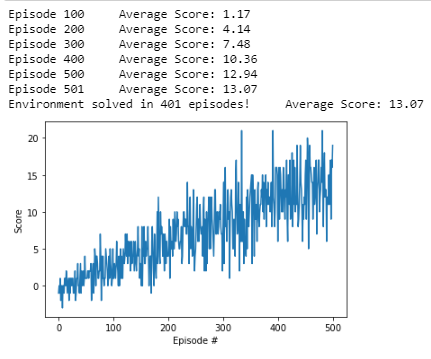

## Report

### Environment description

For this project, the agent navigates (and collect bananas!) in a large, square world. 

A reward of +1 is provided for collecting a yellow banana, and a reward of -1 is provided for collecting a blue banana. Thus, the goal of your agent is to collect as many yellow bananas as possible while avoiding blue bananas.

The state space has 37 dimensions and contains the agent's velocity, along with ray-based perception of objects around agent's forward direction. Given this information, the agent has to learn how to best select actions. Four discrete actions are available, corresponding to:

0 - move forward.
1 - move backward.
2 - turn left.
3 - turn right.
The task is episodic, and in order to solve the environment, your agent must get an average score of +13 over 100 consecutive episodes.

### Learning Algorithm

I've used the Deep Q-Learning algorithm to train the agent to navigate the environment and pick up yellow bananas while avoiding blue bananas. The Deep Q-Learning algorithm represents the optimal action-value function as a neural network (instead of a Q-table). 

As we have learned in the course, reinforcement learning is notoriously unstable when neural networks are used to represent the action values. Fortunately, the Deep Q-Learning algorithm can address these instabilities by using two key features: Experience Replay and Fixed Q-Targets.

When the agent interacts with the environment, the sequence of experience tuples can be highly correlated. The naive Q-learning algorithm that learns from each of these experience tuples in sequential order runs the risk of getting swayed by the effects of this correlation. By instead keeping track of a replay buffer and using experience replay to sample from the buffer at random, we can prevent action values from oscillating or diverging catastrophically. In this case, I've used a replay buffer that retains the 100,000 most recent experience tuples.

The Deep Q-Learning algorithm uses two separate networks with identical architectures. This is referred to as Fixed Q-Targets. Without fixed Q-targets, we would encounter a harmful form of correlation, whereby we shift the parameters of the network based on a constantly moving target. The target Q-Network's weights are updated less often than the primary Q-Network. In this case, I update the target Q-Network's weights every 4 steps.

For the neural networks, I've chosen a 2-layer fully-connected architecture, each layer having 64 neurons. The input size is 37 for the state dimensions (velocity, direction, ray-based perception of objects, etc.) and it maps to an output size of 4, for each possible action (forward, backward, left, right). The activation functions are RELUs. Dropout and/or BatchNorm layers could be used for regularization.

### Results

The agent solved the environment (average score of +13 over 100 consecutive episodes) after approximately 400 episodes, which only took about 10 minutes of training.

### Ideas for Future Work

* Tune hyperparameters
* [Double Q-learning](https://arxiv.org/abs/1509.06461) to have two separate function approximators that must agree on the best action, and thus prevent the algorithm from propagating incidental high rewards that may have been obtained by chance
* [Prioritized Experience Replay](https://arxiv.org/abs/1511.05952) to replay important transitions more frequently, and therefore learn more efficiently
* [Dueling Network Architecture](https://arxiv.org/abs/1511.06581), which uses two streams at the end of the network: one that estimates the state-value function, and one that estimates the advantage for each action
